<h1 align="center">
  StarWars Planet API (sw-planet-api)
</h1>

<p align="center">
  <a href="#-technologies">Tecnologias</a>&nbsp;&nbsp;&nbsp;|&nbsp;&nbsp;&nbsp;
  <a href="#-introdução">Introdução</a>&nbsp;&nbsp;&nbsp;&nbsp;&nbsp;&nbsp;
</p>

<p align="center">
  
  
</p>

# Estudo Final Testes 

## Referência: Testes automatizados na prática com Spring Boot
[Compre aqui](https://www.udemy.com/course/testes-automatizados-na-pratica-com-spring-boot/)
<hr>

## Dica para leitura:
Durante o estudo, os códigos mudam pois geralmente é ensinado algo básico onde depois iremos implementar o que de fato
é utilizado no mercado de trabalho. Tome cuidado ao considerar códigos do início do estudo, se atente ao código final.

## ✨ Technologies

- [Mysql](https://dev.mysql.com/downloads/mysql/)
- [Java](https://www.oracle.com/java/technologies/downloads/)
- [Maven](https://maven.apache.org/download.cgi)
- [Spring Boot](https://spring.io/projects/spring-boot)
- [Spring Testing](https://docs.spring.io/spring-framework/docs/current/reference/html/testing.html#testing-introduction)
- [JUnit 5](https://junit.org/junit5/docs/current/user-guide/)
- [Mockito](https://site.mockito.org)
- [AssertJ](https://github.com/assertj/assertj)
- [Hamcrest](http://hamcrest.org/JavaHamcrest/)
- [Jacoco](https://github.com/jacoco/jacoco)
- [Pitest](https://pitest.org)


## 📌 Tópicos


<!-- TOC -->
* [Estudo Final Testes](#estudo-final-testes-)
  * [Referência: Testes automatizados na prática com Spring Boot](#referência-testes-automatizados-na-prática-com-spring-boot)
  * [Dica para leitura:](#dica-para-leitura)
  * [✨ Technologies](#-technologies)
  * [📌 Tópicos](#-tópicos)
* [💻 Introdução](#-introdução)
  * [✅ Separando as fases de teste](#-separando-as-fases-de-teste)
    * [Para fazermos isso com o Maven, utilizaremos plugins](#para-fazermos-isso-com-o-maven-utilizaremos-plugins)
      * [🧪 Testes de Integração (mais pesados) - Plugin Failsafe](#-testes-de-integração-mais-pesados---plugin-failsafe)
  * [🧪 Testes de cobertura com o Jacoco](#-testes-de-cobertura-com-o-jacoco)
    * [🛠️ Pequenos ajustes](#-pequenos-ajustes)
      * [Método main não sendo chamado](#método-main-não-sendo-chamado)
      * [toString não sendo coberto em Planet](#tostring-não-sendo-coberto-em-planet)
      * [QueryBuilder - Construtor não sendo chamado](#querybuilder---construtor-não-sendo-chamado)
  * [🧪 Teste Mutantes com Pitest](#-teste-mutantes-com-pitest)
    * [Dentro de Domain](#dentro-de-domain)
      * [Planet.java](#planetjava)
      * [QueryBuilder.java](#querybuilderjava)
  * [🧪 Testes de integração com Testcontainers](#-testes-de-integração-com-testcontainers)
    * [Como utilizar o banco do test containers e não o de desenvolvimento?](#como-utilizar-o-banco-do-test-containers-e-não-o-de-desenvolvimento)
  * [🧪 Testes Parametrizados](#-testes-parametrizados)
* [📖 Resumo](#-resumo)
<!-- TOC -->

<hr>


# 💻 Introdução

Agora, faremos alguns toques finais no projeto, pensando no ambiente de produção. Alguns detalhes a mais, para termos
certeza de que testamos tudo o que era possível, evitando erros.

<hr>

## ✅ Separando as fases de teste

Separaremos os testes mais pesados em uma fase específica de testes e os testes mais leves em outra fase.

A ideia é pensar no build do projeto otimizando ele, para que seja rápida a entrega contínua do produto nos ambientes.
E só executar em alguns casos específicos, as tarefas mais pesadas.

Para isso, iremos separar o build em fases, utilizando o Maven, a execução dos testes terão duas fases distantes: 
**leves e pesados**.

- Testes mais leves: criaremos uma fase de testes de unidade.

- Testes mais pesados: criaremos uma fase de testes de integração.

Isso será útil, pois, quando formos configurar a esteira de entrega contínua podemos colocar o teste de integração
somente no ambiente de desenvolvimento e os unitários em ambiente de produção, por exemplo: 

### Para fazermos isso com o Maven, utilizaremos plugins

Por padrão, os testes que possuem o sufixo "Test", rodam na mesma fase. Portanto, teremos um plugin para testes de 
unidade e outro para de integração.


- #### 🧪 Testes de Unidade (mais leves) - Plugin SureFire
```xml
<!-- Unit Tests -->
<plugin>
  <groupId>org.apache.maven.plugins</groupId>
  <artifactId>maven-surefire-plugin</artifactId>
  <version>3.3.1</version>
  <configuration>
    <argLine>-XX:+EnableDynamicAgentLoading -Xshare:off</argLine>
  </configuration>
</plugin>
```

#### 🧪 Testes de Integração (mais pesados) - Plugin Failsafe
```xml
<!-- Integration Tests -->
<plugin>
  <groupId>org.apache.maven.plugins</groupId>
  <artifactId>maven-failsafe-plugin</artifactId>
  <executions>
    <execution>
      <goals>
        <goal>integration-test</goal>
        <goal>verify</goal>
      </goals>
    </execution>
  </executions>
</plugin>
```

Os testes de unidade é sempre importante executar, já são executados por padrão. Os de integração que precisam ser
configurados.

<hr>

## 🧪 Testes de cobertura com o Jacoco

Como saber se testamos todos os caminhos possíveis que a nossa aplicação poderia seguir? A cobertura irá checar se 
todos os fluxos de códigos que foram implementados estão sendo exercitados pelo teste. Isso são **testes de cobertura**.

A forma padrão de fazer isso é utilizando o plugin Jacoco. Ele mede esta cobertura de testes e gera um relatório muito
útil.

O Jacoco por padrão não é executado ao inicio do teste. Precisamos dizer o que vai acontecer, os alvos de cada etapa
que está sendo executado no teste.

```xml
<!-- https://mvnrepository.com/artifact/org.jacoco/jacoco-maven-plugin -->
<plugin>
  <groupId>org.jacoco</groupId>
  <artifactId>jacoco-maven-plugin</artifactId>
  <version>0.8.8</version>
  <executions>
    <!-- Preparar a coleta de dados antes dos testes, gerando o arquivo jacoco.exec -->
    <execution>
      <id>prepare-agent</id>
      <goals>
        <goal>prepare-agent</goal>
      </goals>
    </execution>
    
    <!-- Gerar o relatório de cobertura após a execução dos testes -->
    <execution>
      <id>report</id>
      <phase>verify</phase>
      <goals>
        <goal>report</goal>
      </goals>
    </execution>
  </executions>
</plugin>
```

Para gerar o arquivo jacoco + o relatório de cobertura:
```
mvn clean verify
```

Será gerado um pacote "site", nele, abrimos o arquivo index.html que conterá o report completo.

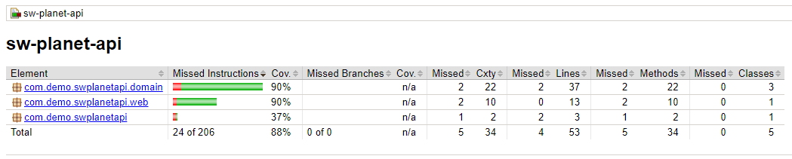
<hr>

### 🛠️ Pequenos ajustes

#### Método main não sendo chamado
É bacana a gente verificar que, por exemplo, o sw.planetapi teve uma cobertura muito baixa, e é um pacote raiz da
aplicação.

Mas, ao adentrarmos para verificar o que houve, vemos que o que aconteceu é que o método main da classe
SwPlanetApiApplication, não foi chamado. 

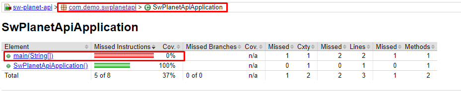

Isso é bem comum, são chamados de falsos positivos. Podemos então configurar o jacoco para ignorar a application.

Para resolver isso, dentro do pom, abaixo da versão do plugin:

```xml
<configuration>
    <excludes>
        <exclude>com/demo/swplanetapi/SwPlanetApiApplication.class</exclude>
    </excludes>
</configuration>
```      

E agora o relatório ficará assim:

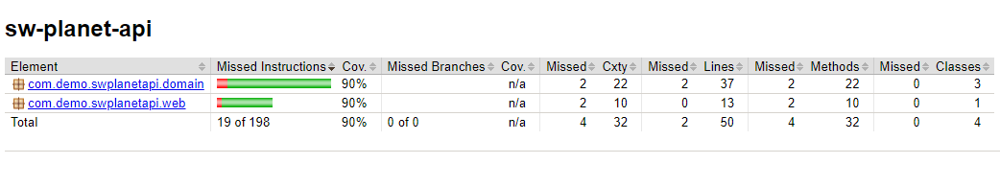
<hr>

#### toString não sendo coberto em Planet

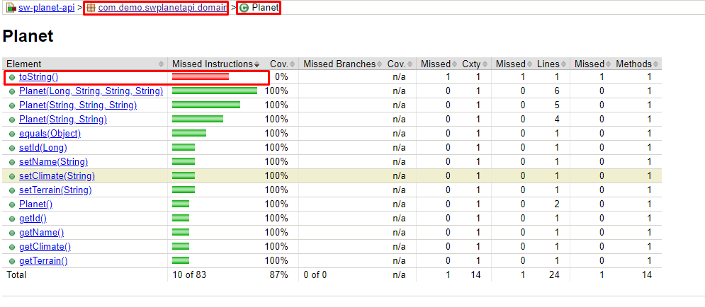

O toString só foi criado para que pudéssemos visualizar os dados no terminal do teste. Não usamos ele para implementar
nenhuma regra de negócio. Além disso, não faz nenhum sentido considerármos o método toString para análise de cobertura.

Então, desconsideraremos o método toString da análise. O Jacoco naturalmente não permite exclusão de métodos, então
criaremos um artifício para adicionar um comportamento exclusivo para um método, para que só ele seja desconsiderado.
Então, **criaremos uma anotação personalizada**.

1. Criaremos um pacote chamado Jacoco dentro da pasta API;
2. Criaremos uma anotação chamada ExcludedFromJacocoGeneratedReport;
3. Ela terá duas propriedades, Retention e Target;
   - @Retention(RetentionPolicty.RUTIME) - Ou seja, será aplicada em tempo de execução;
   - @Target(ElementType.METHOD) - Será aplicada para um método que estiver usufrindo esta anotação.

Por padrão, o Jacoco irá procurar se existe alguma coisa com "Exclude" no nome. E se sim, ele desconsiderará da
cobertura. Depois disso é só ir até a classe Planet e passar a anotação:
```java
@ExcludedFromJacocoGeneratedReport
    @Override
    public String toString() {
        return "Planet{" +
                "id=" + id +
                ", name='" + name + '\'' +
                ", climate='" + climate + '\'' +
                ", terrain='" + terrain + '\'' +
                '}';
    }
```

Relatório após isso:

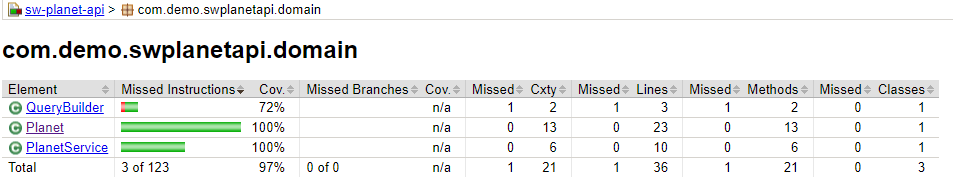
<hr>

#### QueryBuilder - Construtor não sendo chamado

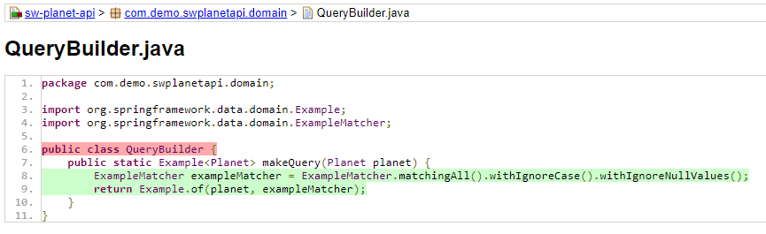

A gente executa o makeQuery, mas não construímos um QueryBuilder, pois ele é estático. Nesses casos, para a análise
de cobertura funcionar, criaremos um construtor vazio e colocaremos como private, usando somente os seus métodos
estáticos.

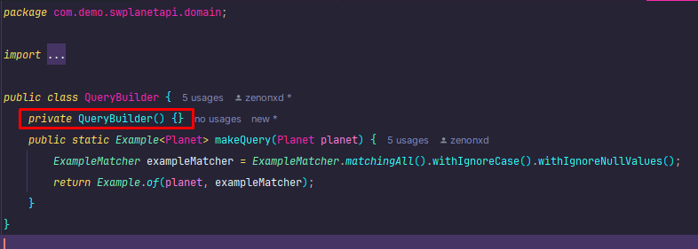

Relatório:

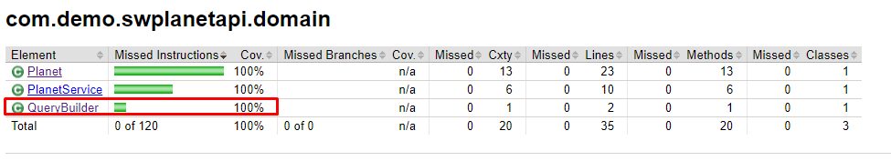

<hr>

## 🧪 Teste Mutantes com Pitest

É possivel aferir a qualidade de um Switch de testes? A ideia dos testes é: **houve alguma mudança no código? Se sim,
ele deve quebrar. Se mudarmos o código e ele não quebrar, nem existe motivo pro teste existir.**

Para avaliarmos isso usaremos os testes mutantes. Em suma, mutações do código original, para ver se o teste detecta essa
mutação e quebra. E bom... se algum teste sobreviver, temos um mutante.

Usaremos o **pitest**, para testar os nossos testes de unidade.

```xml
<dependencies>
  <dependency>
    <groupId>org.junit.jupiter</groupId>
    <artifactId>junit-jupiter-api</artifactId>
    <version>5.10.2</version> <!-- Use a versão mais recente disponível -->
    <scope>test</scope>
  </dependency>
  
  <dependency>
    <groupId>org.junit.jupiter</groupId>
    <artifactId>junit-jupiter-engine</artifactId>
    <version>5.10.2</version> <!-- Use a versão mais recente disponível -->
    <scope>test</scope>
  </dependency>
</dependencies>

        <!-- Plugin PIT -->
<plugin>
  <groupId>org.pitest</groupId>
  <artifactId>pitest-maven</artifactId>
  <version>1.16.1</version> <!-- Use a versão mais recente disponível -->
  <dependencies>
    <dependency>
      <groupId>org.pitest</groupId>
      <artifactId>pitest-junit5-plugin</artifactId>
      <version>1.2.1</version>
    </dependency>
</dependencies>

  <configuration>
    <targetTests>
      <param>com.demo.swplanetapi.*Test</param> <!-- Ajuste para o seu pacote de testes -->
    </targetTests>
  </configuration>
  <executions>
    <execution>
      <goals>
        <goal>mutationCoverage</goal>
      </goals>
    </execution>
  </executions>
</plugin>
```

Os testes mutantes são muito mais lentos, pois cria combinações de código para mutar o nosso código original, por isso,
para rodar com teste de integração não vale a pena.

Para testar no terminal:
```
mvn clean test pitest:mutationCoverage
```

E depois, dentro do pacote "pit-reports", teremos uma pasta com o "YY/MM/DD/HHMM", com o index.html.

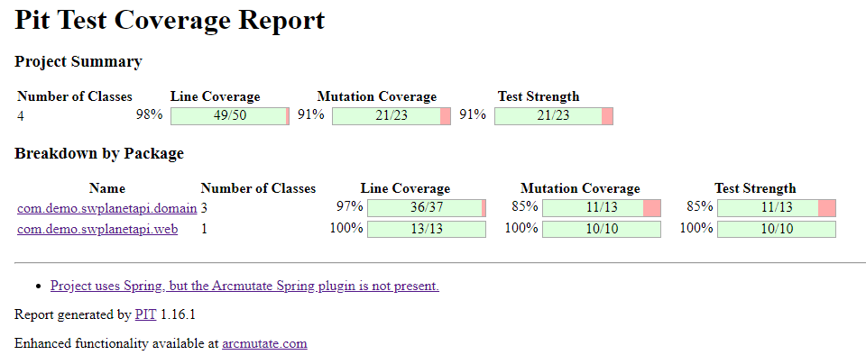

O que faltou exercitar?

### Dentro de Domain

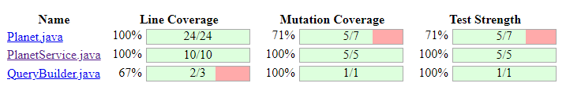


#### Planet.java

Equals e toString não quebraram.

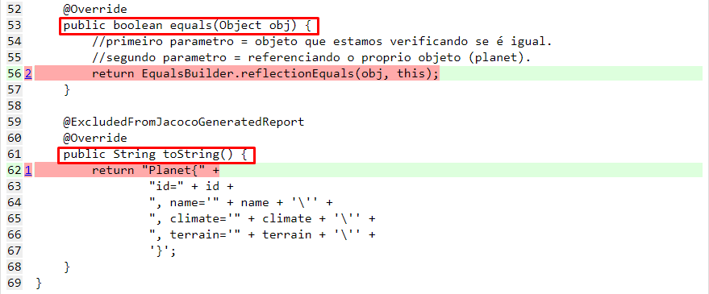


O que devemos fazer, é excluí-los dos testes mutantes dentro do pom (em configuration e excludeClasses).
```xml
<configuration>
  <targetTests>
    <param>com.demo.swplanetapi.*Test</param> <!-- Ajuste para o seu pacote de testes -->
  </targetTests>
  <excludedClasses>
    <param>com.demo.swplanetapi.domain.Planet</param>
  </excludedClasses>
</configuration>
```

E com isso, não teremos mais falsos positivos.

Pit atualizado:

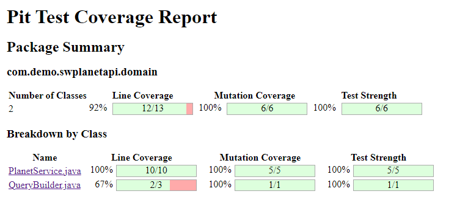
<hr>

#### QueryBuilder.java

A única coisa que "faltou" é o construtor private QueryBuilder.

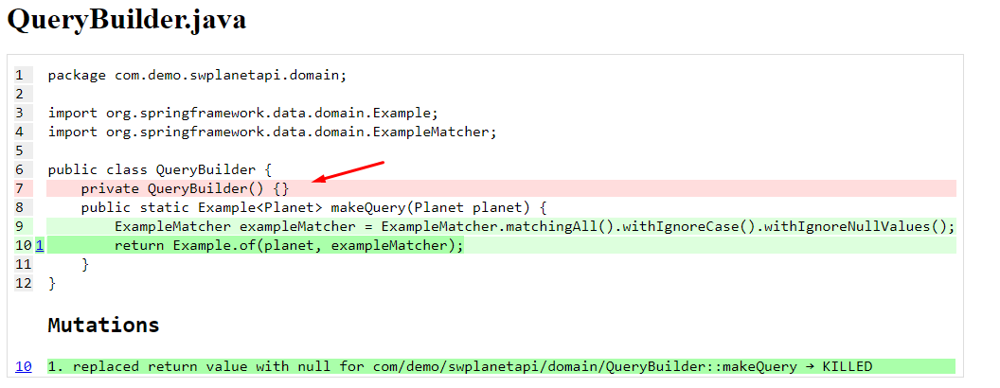

Isso a gente não considera, pois é um falso positivo. Não precisa ser chamado.

Isso nós dá a cobertura de 100% dos testes mutantes, cobrindo o MÁXIMO de cenários possíveis.

<hr>

## 🧪 Testes de integração com Testcontainers

Nesse projeto, utilizamos um .properties dentro dos testes para utilizar um banco dedicado a testes. O problema dessa
abordagem é que dependemos de um banco DEDICADO para fazer os nossos testes. Ou seja, se alguem está mexendo no 
simultaneamente, pode ter algumas instabilidades, a ponto de ficar procurando erro que não existe.

O interessante é isolar, deixando os testes menos frágeis, para não dependerem de banco de dados externos, por exemplo.

Dentro do Spring, tem a possibilidade de usarmos **Containers**/ContainersDocker. Ou seja, ao invés de usar um banco 
externo (fisico), vamos subir um container para representar esse banco mySQL, com a biblioteca TestContainers.

```xml
<dependency>
   <groupId>org.testcontainers</groupId>
   <artifactId>junit-jupiter</artifactId>
   <scope>test</scope>
</dependency>

<dependency>
   <groupId>org.testcontainers</groupId>
   <artifactId>testcontainers-bom</artifactId>
   <version>1.20.0</version>
   <type>pom</type>
   <scope>import</scope>
   </dependency>

<dependency>
   <groupId>org.testcontainers</groupId>
   <artifactId>mysql</artifactId>
   <scope>test</scope>
</dependency>
```

Com isso, precisamos dizer no teste (PlanetIT), qual a imagem que vamos subir para representar esse banco quando
rodarmos esse teste. Para isso, instalaremos o docker.

Com ele, podemos baixar as imagens que o teste precisa (mysql) e executar o teste sem nenhum problema.

### Como utilizar o banco do test containers e não o de desenvolvimento?
1. Tiraremos username e senha do application-it.properties;
2. Mudar URL do banco, veja: 

É só colocar depois dos ":", um "tc:";

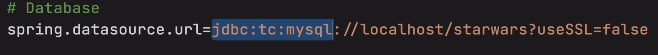

E assim, usaremos o banco mySQL do test containers.

Depois de "mysql", colocaremos ":8.0", informando a sua versão. Com isso, o testcontainers baixará uma imagem do mysql
nessa versão.

Após isso a versão ":///db". "Db" seria o nome do banco de teste. Aqui, pode ser qualquer coisa, pois a imagem irá subir
e depois sumir.

Por fim "?TC_IMAGE_TAG=8.0" informando qual tag a imagem mysql será baixada. Url final:
```properties
spring.datasource.url=jdbc:tc:mysql:8.0///db?TC_IMAGE_TAG=8.0
```
Ao executar todos os testes do PlanetIT (testes de integração), nos logs o docker irá baixar a imagem exatamente da
versão 8.0, conforme especificamos.
<hr>

## 🧪 Testes Parametrizados

E se precisássemos de um gerador de dados inválidos para realizar alguns testes?

Podemos criar um método estátioco com várias Stream de argumentos, veja:
```java
    private static Stream<Arguments> providesInvalidPlanets() {
        //como são atributos obrigatórios, qualquer "null" presenta, dará exception
        return Stream.of(
                Arguments.of(new Planet(null, "climate", "terrain")),
                Arguments.of(new Planet("name", null, "terrain")),
                Arguments.of(new Planet("name", "climate", null)),
                Arguments.of(new Planet(null, null, "terrain")),
                Arguments.of(new Planet(null, "climate", null)),
                Arguments.of(new Planet("name", null, null)),
                Arguments.of(new Planet(null, null, null)),
                Arguments.of(new Planet("", "climate", "terrain")),
                Arguments.of(new Planet("name", "", "terrain")),
                Arguments.of(new Planet("name", "climate", "")),
                Arguments.of(new Planet("", "", "terrain")),
                Arguments.of(new Planet("", "climate", "")),
                Arguments.of(new Planet("name", "", "")),
                Arguments.of(new Planet("", "", ""))
        );
    }
```

Com isso, temos todas as combinações de possíveis cenários de algum dado ser inválido.

Após isso, só precisamos chamar este método dentro do teste, para que estes dados sejam usados na execução do teste.

Para isso, usaremos a anotação @ParameterizedTest e @MethodSource(informando o nome do método).

Código antes de ser alterado:

```java
    @Test
    public void createPlanet_WithInvalidData_ThrowsException() {
        Planet emptyPlanet = new Planet(null, null, null);
        Planet invalidPlanet = new Planet("", "", "");
        
        assertThatThrownBy(() -> planetRepository.save(invalidPlanet)).isInstanceOf(RuntimeException.class);
        assertThatThrownBy(() -> planetRepository.save(emptyPlanet)).isInstanceOf(RuntimeException.class);
    }
```

Depois:

Apagamos as duas intanciações de emptyPlanet e invalidPlanet, e passamos um planet como parâmetro, testando
somente ele. Esse "planet", passado irá assumir o valor de cada argumento hipotético criado ali em cima. Ele vai rodar
uma vez para cada combinação criada.

```java
    @ParameterizedTest
    @MethodSource("providesInvalidPlanets")
    public void createPlanet_WithInvalidData_ThrowsException(Planet planet) {
        
        assertThatThrownBy(() -> planetRepository.save(planet)).isInstanceOf(RuntimeException.class);
    }
```

<hr>

# 📖 Resumo

Lembrar de separar as [fases de testes](#-separando-as-fases-de-teste) (entre leves e pesados).

Lembrar de colocar o Jacoco para ignorar a [application](#método-main-não-sendo-chamado)

Pitest para testar [mutações](#teste-mutantes-com-pitest) em testes de unidade.
<hr>


